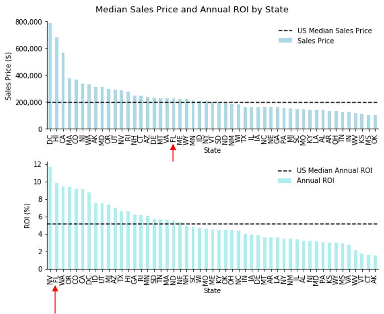
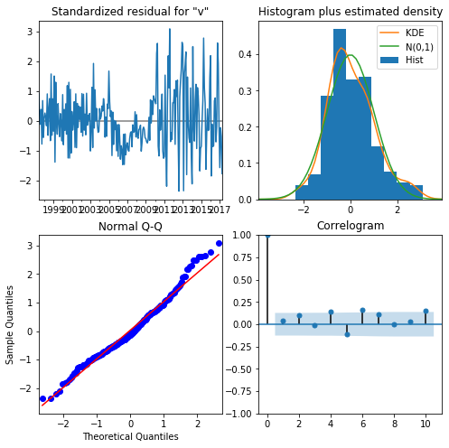
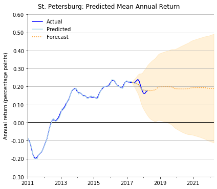
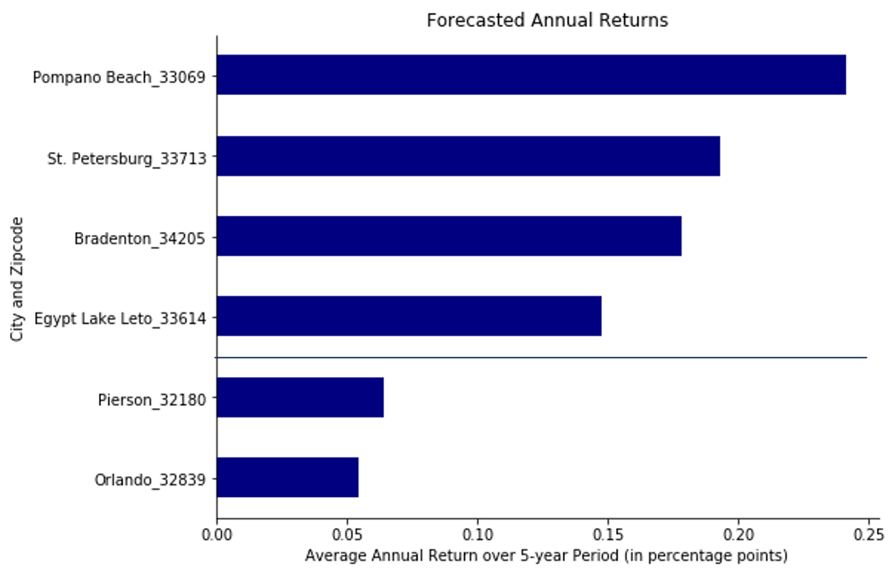

# Phase 4 Project: Time Series Forecasting

Author: Magali Solimano

Date: October 2022

## Project Overview

The Phase 4 Project applies time series modeling to forecast housing prices.

## Objectives

First-time homeowners are looking to invest in residential real estate with the goal of maximizing returns
over a 5y period. The buyers would like to identify the top 5 best zip codes to invest in. 

This analysis will focus on zipcodes with below-median sales price and annual ROI (over previous 5 years)
in the 90th percentile in the state of Florida, which exploratory data analysis shows has a high percentage
of zipcodes that meet this criteria.



## The Data

The project uses [Zillow Research data](https://www.zillow.com/research/data/), which can be found in  `zillow_data.csv` in the data folder in this repo. The description of the column names can be found in the repo's Jupyter Notebook. The dataset has nearly 15,000 zipcodes and 300 variables, of which more than 270 are monthly time series data.

## Methods
The analysis utilizes descriptive data analysis and descriptive statistics, in addition to time series modeling. Based on the selection criteria, ten Florida zipcodes were identified as candidates for modelling.

## Results



After preparing and examining the data, the baseline SARIMAX model was run and fit on all ten zipcodes. Subsequent model iterations were based on identified best parameters, which resulted in improved model performance for eight of ten zipcodes. Training data performed better than the testing data, which was comprised of the last 12 months of data, meaning that the models may be overfitting and may not do well with new data. The forecasts have wide confidence intervals, indicating that there is uncertainty regarding the results.



## Recommendations
Four zipcodes in Pompano Beach (Miami-Ft.Lauderdale metro area), Bradenton (North Port-Sarasota-Bradenton), St. Peterburg (Tampa metro area), and Egypt Lake Leto (Tampa metro area) are recommended 5-year investments. These zipcodes have sales prices
below the state median of $226k, and forecasted average annual returns in the 15%-25% range.

Pierson (Daytona Beach metro area) and Orlando zipcodes are not recommended investments--the models forecast lower returns 
and a higher model error compared to the other zipcodes.



## Next Steps
Since forecasts are based only on historical returns, model improvements should take into account other external factors (such as mortgage rates and economic indicators) and evaluate model performance to improve forecast quality. Furthermore, this analysis intentionally focused on the full historical dataset and did not focus exclusively on the post-housing crisis period;
further model iterations could explore results using data from 2011 onwards. 

## More Information
See the full analysis in the [Jupyter Notebook](https://github.com/magalisolimano/time-series/blob/main/notebook.ipynb) or review the [presentation](https://github.com/magalisolimano/time-series/blob/main/presentation_phase4.pdf). For additional information, contact Magali Solimano at magali.solimano@gmail.com.


## Repository Structure
```
├── data
├── images
├── README.md
├── notebook.ipynb
└── presentation_phase4.pdf
```
